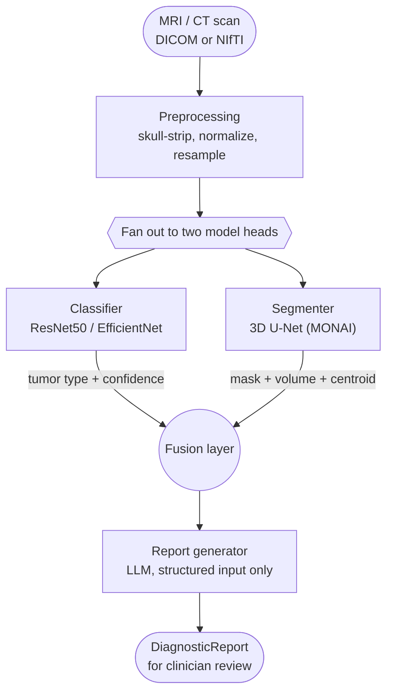

# Brain Tumor Diagnosis Assistant

A multi-stage pipeline that takes an MRI (or CT) scan and produces a **classification** (tumor type), a **detection/segmentation** (where it is, how big), and a **diagnosis narrative** (a clinician-readable report) — decision support, not an autonomous diagnosis.

This is a scaffold: real architecture and working interfaces throughout, with model weights untrained and a few steps (skull-stripping, PDF/DICOM ingestion) left as clearly marked stubs. It's meant to be trained and filled in, not run as-is against real patients.

## Architecture



Same pattern as the research-agent project this was modeled on: independent branches do focused work, a fusion step merges structured outputs, a synthesis step narrates the result. Here the "researchers" are two neural nets instead of LLM agents — and the LLM at the end never sees a pixel, only numbers the models already computed.

## Project Structure

```
brain-tumor-dx/
├── app.py                          # Streamlit UI — upload a scan, see the report
├── pyproject.toml
├── .env.example
├── data/
│   ├── raw/                        # classification/ + segmentation/ (gitignored, see data/README.md)
│   └── processed/
├── serving/
│   ├── api.py                      # FastAPI: POST /predict
│   └── schemas.py
├── scripts/
│   ├── download_data.py            # scaffolds data/raw/ layout + dataset pointers
│   └── run_pipeline_cli.py         # run the pipeline on one local file
├── tests/
│   └── test_pipeline.py            # shape + metric tests, no GPU/checkpoints needed
└── src/brain_tumor_dx/
    ├── config.py                   # env-driven Settings
    ├── pipeline.py                 # orchestrates: preprocess -> classify+segment -> fuse -> report
    ├── data/
    │   ├── io.py                   # DICOM / NIfTI / 2D image loaders
    │   ├── preprocessing.py        # skull-strip, normalize, resample
    │   └── datasets.py             # PyTorch Datasets for both training tasks
    ├── models/
    │   ├── classifier.py           # TumorClassifier (ResNet50/EfficientNet)
    │   ├── segmentation.py         # TumorSegmenter (MONAI 3D U-Net)
    │   └── registry.py             # checkpoint loading, cached
    ├── inference/
    │   ├── classify.py
    │   ├── segment.py
    │   └── fusion.py                # merges both outputs -> DiagnosticFinding
    ├── explainability/
    │   └── gradcam.py               # Grad-CAM heatmap for the classifier
    ├── report/
    │   ├── schema.py                # DiagnosticFinding / DiagnosticReport (Pydantic)
    │   └── generator.py             # structured-output LLM call -> DiagnosticReport
    ├── training/
    │   ├── train_classifier.py
    │   └── train_segmentation.py
    └── evaluation/
        └── metrics.py               # Dice, IoU, accuracy, confusion matrix
```

## Getting Started

### Install

```bash
cd brain-tumor-dx
pip install -e .
cp .env.example .env      # fill in GOOGLE_API_KEY / GROQ_API_KEY for report generation
```

`monai`, `torch`, and `grad-cam` are heavier installs — expect this to take a few minutes, and install a CUDA build of torch separately first if you have a GPU.

### Get data + train

```bash
python scripts/download_data.py     # scaffolds data/raw/ and prints dataset links
# manually download into data/raw/classification/ and data/raw/segmentation/, then:

python -m brain_tumor_dx.training.train_classifier --data-root data/raw/classification
python -m brain_tumor_dx.training.train_segmentation --data-root data/raw/segmentation
```

Checkpoints land in `checkpoints/`, which `models/registry.py` picks up automatically via `.env`'s `CLASSIFIER_CKPT_PATH` / `SEGMENTATION_CKPT_PATH`. Without checkpoints present, the pipeline still runs end-to-end — the classifier falls back to ImageNet-initialized weights and the segmenter to random weights, so you can smoke-test the plumbing before you have trained models.

### Run

```bash
# One-off, from the CLI:
python scripts/run_pipeline_cli.py path/to/scan.nii.gz

# Interactive UI:
streamlit run app.py

# HTTP API:
uvicorn serving.api:app --reload
```

### Test

```bash
pytest tests/
```

## What's a real implementation vs. a stub

To be upfront about scaffold vs. production-ready, since this matters more than usual for a health-adjacent project:

| Component | Status |
|---|---|
| Classifier / segmenter architectures | Real (torchvision ResNet/EfficientNet, MONAI U-Net) — need training |
| Preprocessing (normalize, resize) | Real |
| Skull stripping | **Stub** — naive percentile threshold; swap for HD-BET or ANTsPyNet before real use |
| PDF/DICOM ingestion in datasets | DICOM loader is real; datasets currently expect the public datasets' native formats (jpg for classification, NIfTI for segmentation) |
| Fusion + report schema | Real |
| Report generation | Real pattern (structured-output LLM call), but only as good as the prompt — review before trusting the "recommendation" field |
| Grad-CAM | Real, assumes ResNet50 backbone |

## License
It is an Apache licensed project.

