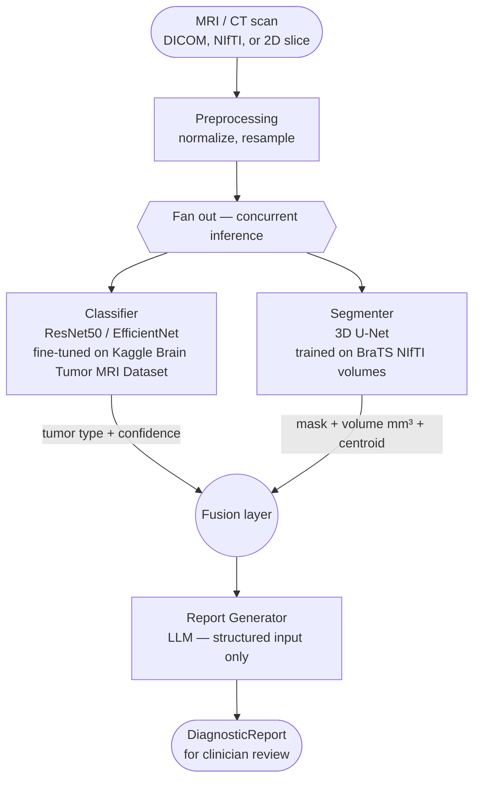

# Brain Tumor Diagnosis Assistant

A multi-stage deep learning pipeline that takes an MRI scan and produces a **tumor-type classification**, a **3D segmentation** (location, volume, centroid), and a **structured diagnostic report** — providing decision support for clinician review.

> **Clinical note:** This system is intended as a decision-support tool. All outputs require review and confirmation by a qualified radiologist before clinical use.

---

## Architecture


```mermaid
flowchart TD
    IN(["MRI / CT scan<br/>DICOM, NIfTI, or 2D slice"]) --> PRE["Preprocessing<br/>normalize, resample"]
    PRE --> SPLIT{{"Fan out — concurrent inference"}}

    SPLIT --> CLS["Classifier<br/>ResNet50 / EfficientNet<br/>fine-tuned on Kaggle Brain Tumor MRI Dataset"]
    SPLIT --> SEG["Segmenter<br/>3D U-Net<br/>trained on BraTS NIfTI volumes"]

    CLS -->|"tumor type + confidence"| FUSE(("Fusion layer"))
    SEG -->|"mask + volume mm³ + centroid"| FUSE

    FUSE --> REPORT["Report Generator<br/>LLM — structured input only"]
    REPORT --> OUT(["DiagnosticReport<br/>for clinician review"])
```

The classifier and segmenter run **concurrently** via `asyncio`. Their outputs are merged into a typed `DiagnosticFinding` by the fusion layer. The LLM report generator only ever sees that structured data — it never receives a pixel.

---

## Project Structure

```
brain-tumor-dx/
├── app.py                          # Streamlit UI — upload a scan, see the report
├── pyproject.toml
├── .env.example
├── data/
│   ├── raw/
│   │   ├── classification/         # glioma/ meningioma/ pituitary/ no_tumor/
│   │   └── segmentation/           # case_001/ … case_369/ (image + mask NIfTI pairs)
│   └── processed/
├── checkpoints/
│   ├── classifier.pt               # trained ResNet50 checkpoint
│   └── segmentation.pt             # trained 3D U-Net checkpoint
├── serving/
│   ├── api.py                      # FastAPI: POST /predict
│   └── schemas.py
├── scripts/
│   ├── download_data.py            # sets up data/raw/ layout + prints dataset links
│   └── run_pipeline_cli.py         # run the full pipeline on a local NIfTI file
├── tests/
│   └── test_pipeline.py            # shape, metric, and loss tests (no GPU required)
└── src/brain_tumor_dx/
    ├── config.py                   # env-driven Settings (device, checkpoints, classes)
    ├── pipeline.py                 # orchestrates: preprocess → classify + segment → fuse → report
    ├── data/
    │   ├── io.py                   # DICOM series, NIfTI, and 2D image loaders
    │   ├── preprocessing.py        # normalize, resample, skull-strip
    │   └── datasets.py             # PyTorch Datasets for both training tasks
    ├── models/
    │   ├── classifier.py           # TumorClassifier (ResNet50 / EfficientNet backbone)
    │   ├── segmentation.py         # TumorSegmenter (3D U-Net with skip connections)
    │   └── registry.py             # cached checkpoint loading
    ├── inference/
    │   ├── classify.py             # preprocess → classifier → {label, confidence, probabilities}
    │   ├── segment.py              # preprocess → segmenter → {mask, volume_mm³, centroid}
    │   └── fusion.py               # merges both outputs → DiagnosticFinding
    ├── explainability/
    │   └── gradcam.py              # Grad-CAM heatmap for classifier predictions
    ├── report/
    │   ├── schema.py               # DiagnosticFinding / DiagnosticReport (Pydantic)
    │   └── generator.py            # structured-output LLM call → DiagnosticReport
    ├── training/
    │   ├── train_classifier.py     # fine-tunes TumorClassifier with AMP + early stopping
    │   └── train_segmentation.py   # trains TumorSegmenter with DiceBCE loss + grad checkpointing
    └── evaluation/
        └── metrics.py              # Dice, IoU, accuracy, confusion matrix
```

---

## Datasets

| Task | Dataset | Format |
|---|---|---|
| Classification | [Kaggle Brain Tumor MRI Dataset](https://www.kaggle.com/datasets/masoudnickparvar/brain-tumor-mri-dataset) | JPEG images, one folder per class |
| Segmentation | [BraTS Challenge](https://www.med.upenn.edu/cbica/brats/) | NIfTI volumes (`image.nii.gz` + `mask.nii.gz` per case) |

The segmentation dataset includes **369 annotated cases**. The classification dataset covers four classes: `glioma`, `meningioma`, `pituitary`, `no_tumor`.

---

## Getting Started

### Install

```bash
cd brain-tumor-dx
pip install -e .
cp .env.example .env      # fill in GOOGLE_API_KEY / GROQ_API_KEY for report generation
```

> `torch`, `torchvision`, and `monai` are heavy installs. If you have a GPU, install the CUDA build of PyTorch first:
> ```bash
> pip install torch torchvision --index-url https://download.pytorch.org/whl/cu121
> ```

### Run with Pre-trained Checkpoints

Trained checkpoints are already present in `checkpoints/`. The pipeline runs end-to-end:

```bash
# One-off CLI inference on a NIfTI scan:
python scripts/run_pipeline_cli.py path/to/scan.nii.gz

# Interactive web UI:
streamlit run app.py

# HTTP API:
uvicorn serving.api:app --reload
```

### Re-training from Scratch

```bash
# 1. Set up the data directory layout:
python scripts/download_data.py

# 2. Download datasets into data/raw/classification/ and data/raw/segmentation/

# 3. Train classifier (ResNet50, Kaggle dataset):
python -m brain_tumor_dx.training.train_classifier \
    --data-root data/raw/classification \
    --epochs 20 --batch-size 16 --lr 1e-4

# 4. Train segmenter (3D U-Net, BraTS NIfTI volumes):
python -m brain_tumor_dx.training.train_segmentation \
    --data-root data/raw/segmentation \
    --epochs 50 --batch-size 1 --input-size 96
```

Checkpoints are saved to `checkpoints/` and picked up automatically by `models/registry.py` via the paths set in `.env`.

### Test

```bash
pytest tests/
```

Tests cover preprocessing shapes, metric correctness (Dice, IoU), the DiceBCE loss, gradient checkpointing, and 3D data augmentation — all run on CPU without requiring trained weights.

---

## Components

| Component | Details |
|---|---|
| **Classifier** | ResNet50 backbone (fine-tuned) — swappable to EfficientNet-B0 via `backbone=` arg. Trained with label smoothing, cosine LR schedule, AMP, and early stopping. |
| **Segmenter** | 3D U-Net with skip connections and gradient checkpointing. Trained with combined DiceBCE loss, gradient accumulation, and cosine LR schedule. |
| **Preprocessing** | Z-score normalization on foreground voxels; percentile clipping for 3D volumes; bilinear / nearest-neighbor resampling to fixed spatial resolution. |
| **Skull stripping** | Intensity-threshold mask for raw volumes. BraTS data is already pre-processed and bypasses this step. |
| **Fusion** | Combines classifier output (type + confidence + per-class probabilities) with segmenter output (binary mask + volume mm³ + centroid) into a `DiagnosticFinding`. |
| **Report generation** | LangChain `init_chat_model` with JSON Schema structured output → validated `DiagnosticReport`. The LLM narrates structured numbers; it never sees pixels. |
| **Grad-CAM** | `pytorch-grad-cam` applied to the last ResNet conv block — produces a per-pixel importance heatmap for classifier predictions. |
| **API** | FastAPI service (`POST /predict`) accepting NIfTI uploads; returns a full `DiagnosticReport` as JSON. |
| **UI** | Streamlit app with scan upload, classification bar chart, segmentation volume metrics, and report display. |

---

## Configuration

All settings are controlled via environment variables (`.env` file):

| Variable | Default | Description |
|---|---|---|
| `GOOGLE_API_KEY` | — | Gemini API key (for report generation) |
| `GROQ_API_KEY` | — | Groq API key (for report generation) |
| `CLASSIFIER_CKPT_PATH` | `checkpoints/classifier.pt` | Path to trained classifier checkpoint |
| `SEGMENTATION_CKPT_PATH` | `checkpoints/segmentation.pt` | Path to trained segmenter checkpoint |
| `DEVICE` | auto-detected | `cuda`, `cpu`, or `mps` |
| `CLASSIFIER_INPUT_SIZE` | `224` | Spatial resolution for classifier input |
| `SEGMENTATION_INPUT_SIZE` | `128` | Spatial resolution for segmenter input (cube) |
| `CONFIDENCE_THRESHOLD` | `0.5` | Below this, the report explicitly flags low confidence |
| `REPORT_MODEL` | `groq:openai/gpt-oss-120b` | LangChain model string for report generation |

---

## License
It is an Apache licensed project.

